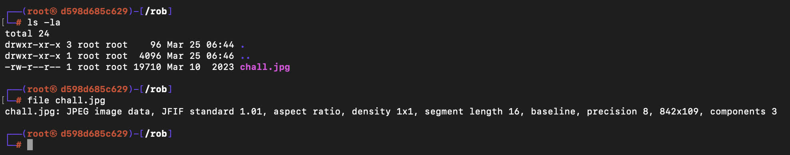
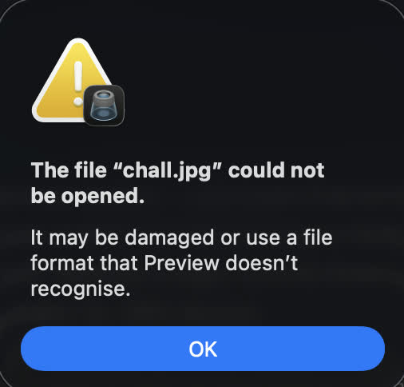
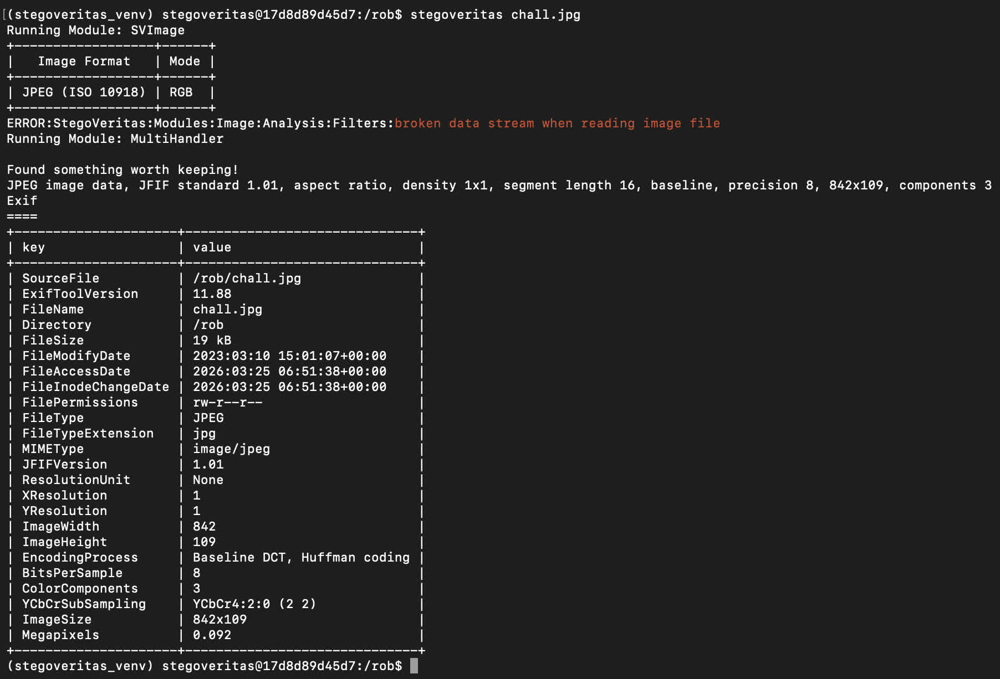
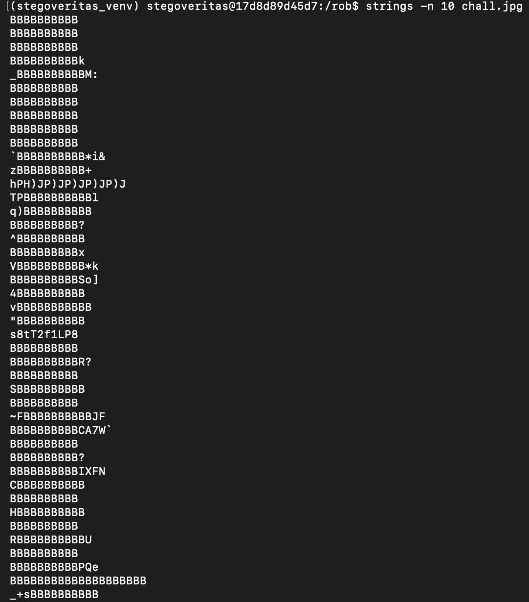
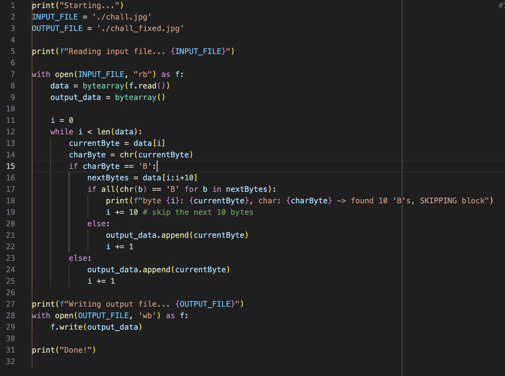
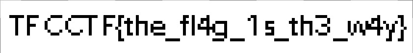

# bbbbbbbbbb.rar

[Challenge link ↗](https://app.cyber-edu.co/challenges/7dda8bf0-44a4-11ed-a822-c1029f0a36e6?tenant=cyberedu)

First things first, lets see what we are working with.

Trying to open the images shows us that its corrupt.

Stegoveritas said it found something, but all images it generated where unusable.

So next ideea is to run strings on the file.

As we can see, there are many chains of B, just like we find in the name and description of the challenge.

Lets write a small python script that will remove these chains.

Opening the new generated image is fruitfull.

