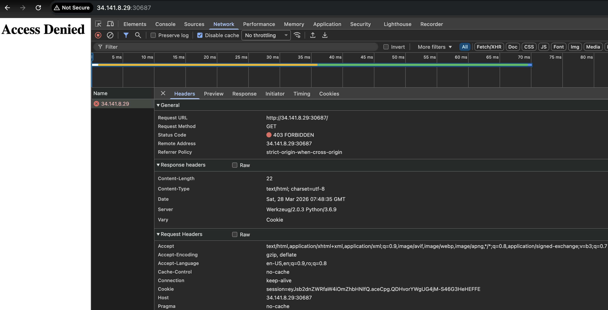
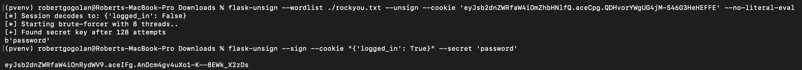
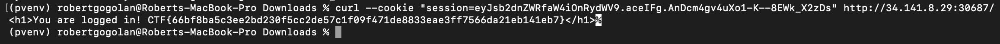

# bbbbbbbbbb.rar

[Challenge link ↗](https://app.cyber-edu.co/challenges/93550ce0-8a54-11ec-b670-134e64dab450?tenant=cyberedu)

For this challange we won't be downloading any file.
Just start the machine provided by CyberEdu.
We can see in the response that we receive status code 403 (FORBIDDEN).
But we can also see that there is a cookie sent by the server, and the version of the server.

I found that Werkzeug 2.0.3 has a Access Restriction Bypass, but I couldn't make it work.
So after some other internet searches I found a page explaining how to brute force the cookie encryption.
https://hacktricks.wiki/en/network-services-pentesting/pentesting-web/flask.html

I followed the steps from there.

And sent the new signed cookie with logged_in: true and it worked.

