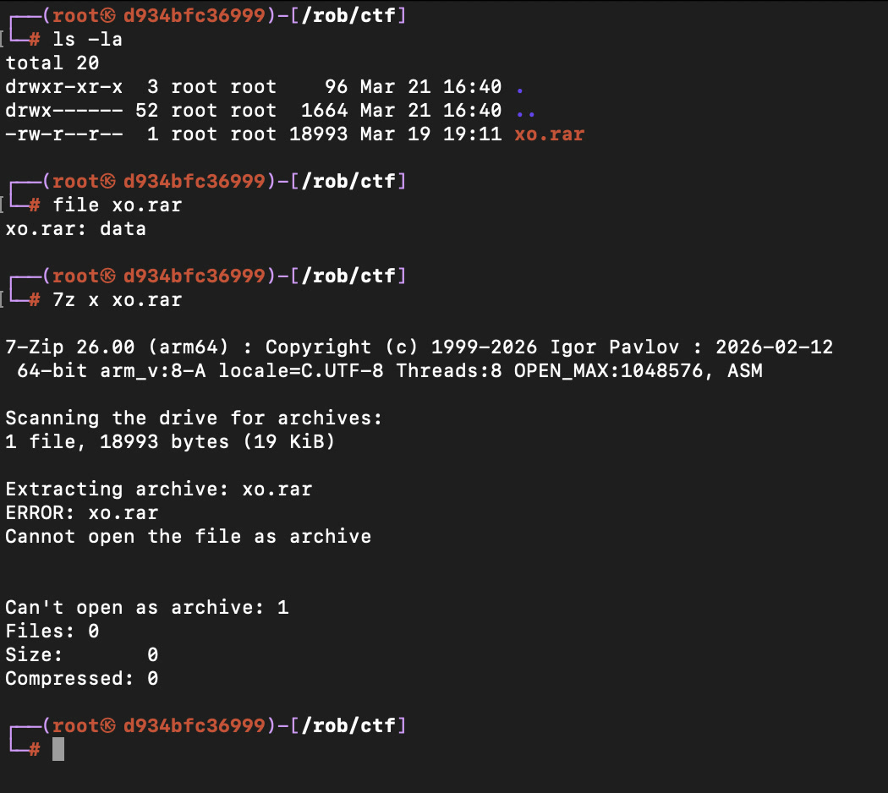
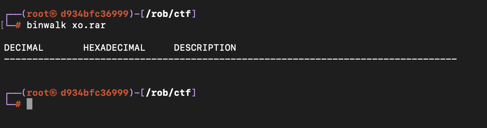
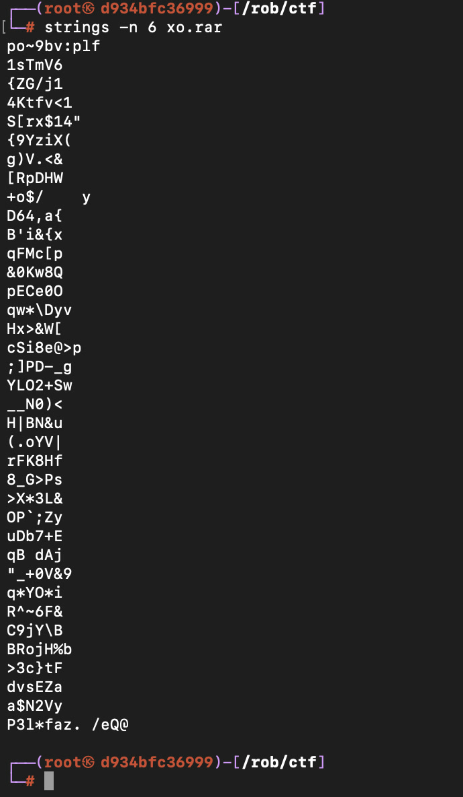
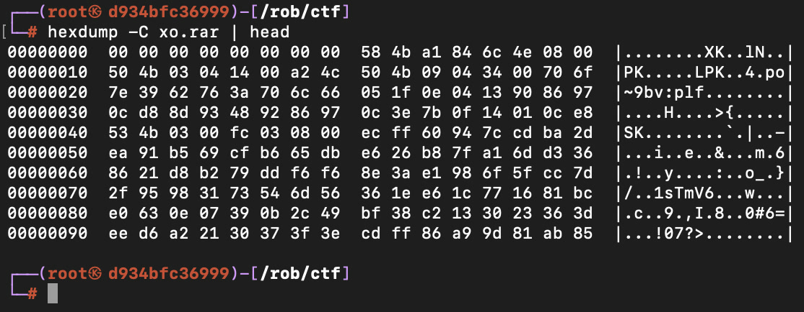
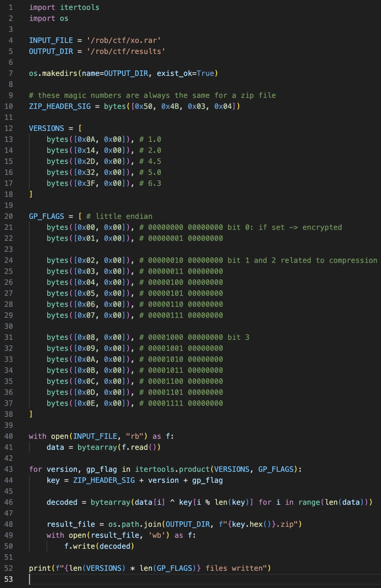
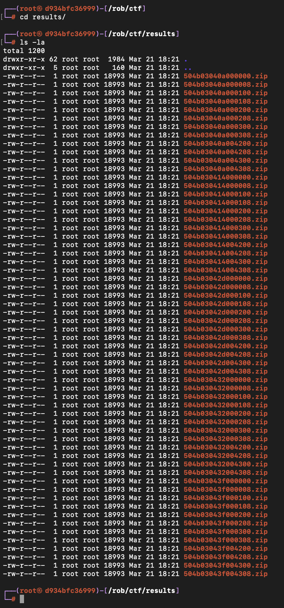
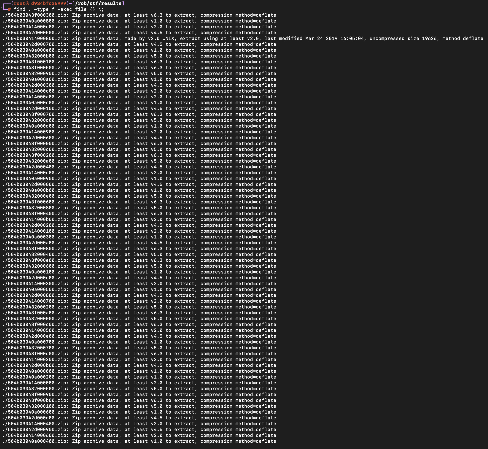
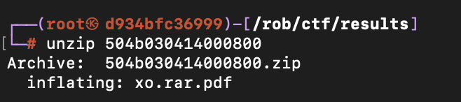
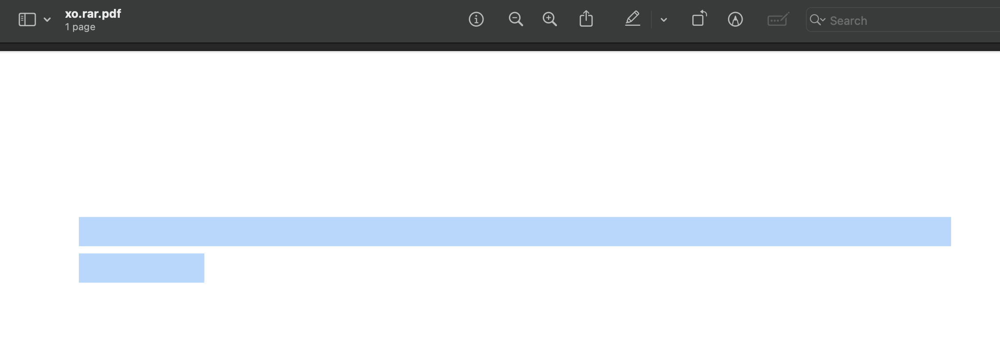

# xo.rar

[Challenge link ↗](https://app.cyber-edu.co/challenges/55d2d910-7f21-11ea-a5c8-a9dda2a5c18b?tenant=cyberedu)

After I downloaded the file, first thing I thought about was to check the file type and confirm the description.

As expected, the file is not a rar.

After running `binwalk` and `strings` on the binary, I still had no lead to follow.

But using `hexdump` yielded something.

The first 8 bytes are 0, so finding an 8-byte key would be useful.

Searching for ZIP file signatures on [this Wiki page](https://en.wikipedia.org/wiki/List_of_file_signatures) gave the first 4 bytes of a possible key.

More info about ZIP local headers can be found on [Wikipedia](<https://en.wikipedia.org/wiki/ZIP_(file_format)>) and the [PKWARE spec](https://pkware.cachefly.net/webdocs/casestudies/APPNOTE.TXT).

The 5th and 6th byte are the ZIP version; the 7th and 8th are the general purpose bit flag.

A small Python script produced a lot of XORed files.

Running `file` on each of them revealed one XORed with the right key.

Extracting it produced a PDF file.

At first it seemed like a blank file, but the content was there.

